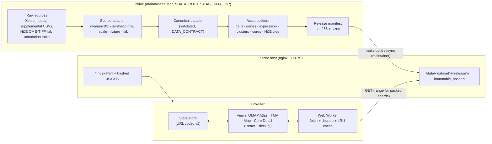

# Tech Spec — Acral Melanoma Spatial Atlas

Version 0.1 (Phase 0). Requirements: `docs/PRD.md`. Entities and validation: `docs/DATA_CONTRACT.md`.
Decisions: `docs/adr/0001`–`0008`. Numbers marked *measured* come from the dev dataset on `$DATA_ROOT`;
everything else is an estimate to be replaced by measurements in `docs/perf.md`.

## 1. Architecture

Static-only (NFR-1): all compute happens offline in the pipeline; the server only serves files.

Build vs adopt: custom React + deck.gl app, no viewer framework (ADR-0001).

## 2. Pipeline

Python ≥ 3.11 with `uv`; `pipeline/` package, CLI `python -m atlas_pipeline <dataset>` behind
`make pipeline DATASET=…`. Deterministic: one seed per dataset config, sorted outputs, pinned encoders.

| Stage | Input → output | Notes |
|---|---|---|
| 0. Verify | `$DATA_ROOT/raw/<dataset>/` → file table | `make data TIER=…`: md5 for supplemental files, size vs `members.txt` for `outs/`; downloads only what is missing. Refuses to run if `$DATA_ROOT` is not mounted. |
| 1. Adapt | raw → in-memory canonical tables | One adapter per source (DATA_CONTRACT §9). Logs every raw file it opens; a guard raises on `transcripts.*`, `morphology*`, `*.zarr.zip`. |
| 2. Validate | canonical → pass/fail | pandera schemas + cross-entity invariants (DATA_CONTRACT §8). Fails loudly. |
| 3. Persist canonical | → `$DATA_ROOT/canonical/<dataset>/` | Parquet tables + expression as AnnData (`.h5ad`, CSR counts). Cache for later stages. Expensive derived inputs (recomputed UMAP) are cached in `$DATA_ROOT/derived/<dataset>/` keyed by input hash + parameters. |
| 4. Derive | canonical → display data | Normalization `log1p(counts / total × 10⁴)` (default, Q15); per-gene quantization; coordinate quantization (UMAP per axis, spatial per section, offset + scale in the manifest); cell ordering (section → core → Morton order of x, y); palettes; per-core crops. |
| 5. Build assets | → `$DATA_ROOT/build/<dataset>/<release>/` | Binary arrays, per-gene expression, JSON tables, H&E tile pyramids, thumbnails (§3). |
| 6. Manifest + report | → `manifest.json`, size report | sha256 per file, bytes per family, total vs NFR-13; build fails if a budget is exceeded. |

**Dev data facts (measured):** 407,124 cells; 5,101 gene features in `cell_feature_matrix.h5` (9,475
features incl. controls; controls are dropped); tissue extent 11,481 × 7,979 µm; 18 groups in the 10x
Cell Groups CSV (17 types + Unassigned); UMAP from `analysis/umap` (Xenium onboard analysis, not the
Seurat run that produced the groups — see UMAP selection below); H&E alignment CSV
is a 3×3 affine with ~90° rotation and scale ≈ 1.29 (direction verified empirically in Phase 1).

**UMAP selection for dev data (Gate 0, `[Diego]`).** The 10x groups and the provided UMAP come from
different analyses, so Phase 1 scores two candidates with a **kNN cluster-coherence score**: for each
cell, the fraction of its 15 nearest UMAP neighbours (itself excluded, Euclidean) that share its 10x
cell group, averaged over all cells. Candidates: (a) the provided Xenium UMAP; (b) a seeded scanpy UMAP
recomputed from the same normalized matrix (`log1p(CP10k)` → PCA 50 → 15-neighbour graph → UMAP, fixed
`random_state`). The pipeline prints both scores and uses the higher (ties keep (a)). (b) is cached as
`$DATA_ROOT/derived/ovarian-10x/umap-<hash>.parquet` with a JSON sidecar of its parameters, library
versions and the hash of the input matrix; later runs reuse it, so NFR-14 holds without recomputing
(T-PIPE-UMAP-01). The choice and both scores go to `dataset.provenance`.

**Synthetic datasets (BRIEF §4.3):** `synthetic-tma` cuts non-overlapping 1 mm cores from the tissue
by seeded Poisson-disk sampling restricted to cores with ≥ 80% tissue coverage, lays them on a TMA grid
over 3 synthetic sections and assigns patients (some with ≥ 2 cores). `scale` replicates cores with new
IDs and jittered positions to ≥ 443K cells, ≥ 100 cores, 62 patients, 3 sections, and reaches 23
clusters by splitting the 5 largest 10x groups in two (seeded k-means on PCA), 18 + 5 = 23. Labels stay
generic (`Tumor Cells · sub 1`): no invented biology. `fixture` is ≤ 5 MB, committed with CC BY
attribution.

## 3. Asset format

Full layout in ADR-0002; expression in ADR-0003; H&E in ADR-0004. Summary per release:

| Family | File(s) | Encoding | Size @ 407K (est.) | Size @ 443K (est.) | Loaded |
|---|---|---|---|---|---|
| Manifest | `manifest.json` | JSON | < 50 KB | < 60 KB | initial |
| UMAP coords | `cells/umap.u16` | uint16 × 2, per-axis offset + scale in manifest | 1.63 MB | 1.77 MB | initial |
| Cluster ids | `cells/cluster.u8` | uint8 | 0.41 MB | 0.44 MB | initial |
| Gene index | `genes.json` | symbols + ids + file refs | ~70 KB | ~70 KB | initial |
| Core ids | `cells/core.u16` | uint16 (patient, section via `cores.json`) | 0.81 MB | 0.89 MB | after interactive |
| Spatial coords | `cells/xy.u16` | uint16 × 2, quantized per section, offset + scale per section in manifest | 1.63 MB | 1.77 MB | TMA Map / Core Detail |
| Transcripts/cell | `cells/ntx.u16` | uint16 | 0.81 MB | 0.89 MB | on hover |
| Tables | `clusters.json`, `cores.json`, `sections.json` | JSON | < 100 KB | < 100 KB | initial |
| Expression | `expr/<gene_id>.bin` | sparse or dense uint8 (ADR-0003) | ~240 MB total | ~260 MB total | per gene |
| H&E | `he/<section>/<core>/{z}/{x}_{y}.webp`, `thumbs/<core>.webp` | 512 px WebP tile pyramid, pre-aligned to µm with Lanczos at ≤ source pixel size; manifest keeps source affine + pixel size | ~0.3 GB | ~0.5 GB | per viewport |
| Cell outlines (Could) | `bounds/<core>.bin` | int16 vertices | ~70 MB | ~80 MB | Core Detail zoom |

Total at lab scale ≈ 0.8–1.0 GB, well under NFR-13 (5 GB). Cells are ordered by section → core →
Morton code, so each core's cells are a contiguous index range recorded in `cores.json`.

## 4. Web architecture

React + TypeScript strict + Vite + deck.gl (ADR-0001). Modules under `web/src/`:

| Module | Responsibility |
|---|---|
| `data/` | Manifest loader, fetch with byte progress and retry, Web Worker decoders, per-gene LRU cache (64 genes), abort on superseded requests |
| `state/` | Single store (Zustand) holding `ViewState`; URL codec with versioned parsers and migrations (ADR-0005) |
| `views/` | `UmapAtlas`, `TmaMap`, `CoreDetail`, `CompareGrid` |
| `layers/` | Cell `ScatterplotLayer` with binary attributes; `DataFilterExtension` for cluster/selection filtering; H&E `TileLayer` + `BitmapLayer`; core outlines `PolygonLayer`; lasso `PolygonLayer` |
| `ui/` | Search/autocomplete, legend, color bar, hover card, export, hints, shortcuts, content pages, error/empty/loading states |
| `export/` | PNG (offscreen render at export resolution) and SVG (legend, axes, scale bar) |

**State** (`ViewState`, serialized to the URL): `release`, `view`, `colorBy` (cluster | patient | core |
gene:<id>), `hiddenClusters`, `selection` (cluster | core | patient | lasso polygon), `cores[]` open in
Core Detail, `opacity`, camera per view. Every number in the URL and in figure exports is in physical
units (µm or UMAP units), never an asset-level quantized integer (ADR-0002, ADR-0005). Derived data (colors, filter masks) is computed in the worker
and never stored in the URL.

**Render layers.** One `ScatterplotLayer` per view over the same GPU buffers: positions (Float32,
decoded from uint16 once), fill colors (RGBA uint8 recomputed on color-mode change), filter category
(cluster) and selection mask. Picking gives the cell index; the hover card reads cluster, core →
patient, gene value from typed arrays. Core Detail: an orthographic view per panel; H&E tiles and cells
share one µm coordinate frame, so synchronized pan/zoom is one shared camera (FR-C1).

## 5. Linked views

A selection is a set of cell indices materialized as a `uint8` mask in the worker from its definition
(cluster, core, patient or lasso polygon). All views read the same mask, so linking is O(n) once per
selection change and O(1) per frame. Lasso polygons are stored in UMAP coordinates in the URL, not as
cell lists, so the URL stays short and deterministic.

## 6. Color

Categorical: a 23-color palette generated for maximum minimum ΔE2000 under normal, protan and deutan
simulation (NFR-7), overridable by the lab (Q12). Continuous: a perceptually uniform sequential map
(viridis family) with 0 = light gray so non-expressing cells recede. Every color encoding has a text
equivalent: legend labels, hover card, and highlight on hover.

## 7. Performance plan

Budgets per interaction. BRIEF NFRs are binding; the others are `[Product]` budgets set here and
enforced by `make bench` on `scale` served by a local static server (ADR-0007).

| Interaction | Budget | Measured by |
|---|---|---|
| Initial load (NFR-3) | < 5 MB transferred before interactive; est. 1.77 + 0.44 + 0.07 + 0.1 + JS ~0.6 ≈ 3.0 MB | Playwright network log until `atlas:interactive` mark |
| Time to interactive | < 3 s p95, local server, cold cache | `performance.mark` |
| Gene switch (NFR-4) | p95 < 300 ms, 50 random genes, cold per-gene cache | mark at selection → first frame with new colors |
| Pan/zoom (NFR-5) | median ≥ 55 fps, all cells | rAF frame times over a 10 s scripted pan/zoom |
| Hover card | < 50 ms p95 | pointermove → card paint |
| Cluster toggle / isolate | < 100 ms p95 | click → frame |
| Lasso (443K cells) | < 200 ms p95 | pointerup → selection count painted |
| TMA Map open | < 1.5 s p95, ≤ 2 MB transferred | view switch → cores drawn |
| Core hover thumbnail | < 150 ms p95 | hover → thumbnail painted (thumbnails prefetched as one sprite) |
| Core open (click → H&E first tiles + cells drawn) | < 1.0 s p95, ≤ 2 MB transferred | click → `core:ready` mark |
| Compare 6 cores | open < 2.5 s p95; pan/zoom median ≥ 55 fps | same marks, fps counter |
| URL restore (cold) | < 4 s p95 to fully rendered state | navigation → `view:ready` |
| PNG export at 2,126 px width | < 5 s | click → blob ready |

Main levers: quantized coordinates, per-gene files, worker decoding, contiguous per-core cell ranges,
WebP tiles, immutable caching (ADR-0002–0006).

## 8. Testing

Strategy in ADR-0007, traceability in `docs/TEST_PLAN.md`. Pytest (+ coverage ≥ 85%) for the pipeline,
vitest (≥ 80% on `state/` and `data/`) for the web, Playwright e2e on chromium, firefox, webkit with
axe-core and a console-error guard, bench scripts, Lighthouse CI, URL fixtures for NFR-16. CI runs
`make verify` on `fixture`; full-scale budgets run locally and are recorded in `docs/perf.md`.

## 9. Deployment

`make build DATASET=…` → `dist/` with the app plus `data/<dataset>/<release>/`. nginx on a LIIGH server
(`atlas.liigh.unam.mx`, Let's Encrypt), `gzip_static`, `Cache-Control: public, max-age=31536000,
immutable` for hashed paths, `no-cache` for `index.html` and `releases.json`, range requests enabled
(ADR-0006). The previous release stays on disk for stable URLs (quota ≥ 10 GB). The maintainer deploys;
the agent never does. Local deployment tests use Homebrew nginx.

## 10. Privacy

- Lab data is read only from `$LAB_DATA_DIR` (encrypted volume) and written only there; never to git,
  CI, logs, screenshots or snapshots (BRIEF §4.1).
- Pipeline logs print aggregate counts only for `lab`; a logging filter rejects cell-level rows.
- Dataset configs carry `visibility: public | private`; `make build` refuses a public build that includes
  a private dataset (NFR-8). Patient IDs in public builds are pseudonymous codes; clinical fields pass an
  allowlist (Q4).
- Pre-commit hook blocks files > 5 MB and data extensions outside `fixtures/`.
- Study-specific text and config live in a private overlay until Q10 is answered (ADR-0008).

## 11. Failure modes

| Failure | Detection | Behavior |
|---|---|---|
| `$DATA_ROOT` not mounted | path check at start | Stop, ask the maintainer to `hdiutil attach`; never fall back to the internal disk |
| Raw file missing / md5 mismatch | stage 0 | Fail with the file table; no partial build |
| Pipeline opens a forbidden file | open-guard | Raise; logged path |
| Schema or invariant violation | stage 2 | Fail with entity, column, count of bad rows (no values for `lab`) |
| H&E missing for a section | adapter | Build continues; Core Detail shows "H&E not available" state |
| Alignment wrong | Phase 1 alignment test | Fail the build for that dataset |
| Budget exceeded (size) | stage 6 | Fail with per-family report |
| Asset 404 / network error | fetch layer | Error state with retry for that asset only (FR-P3) |
| Manifest hash mismatch | worker | Treat as error; do not render stale data |
| Unknown URL version or release | URL codec | Migrate if possible; else open the release list with a notice, never a blank page |
| WebGL unavailable / context lost | deck.gl init / event | Fallback page; on context loss, re-init once then show error |
| Gene not in panel | search | Empty state with closest symbols |
| Low-memory mobile | allocation failure | Read-only reduced mode notice (NFR-6 best-effort) |
